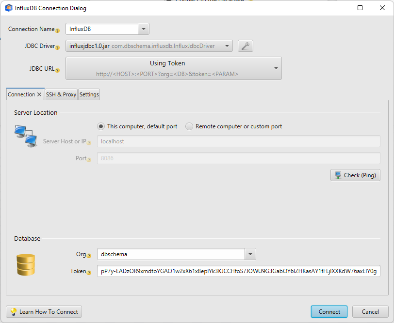
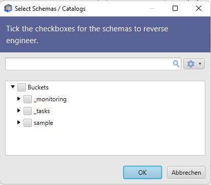
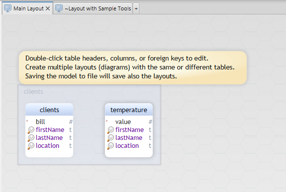
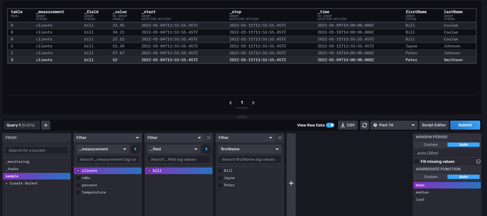
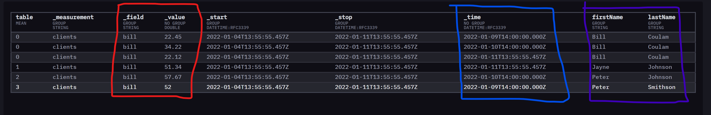

# Influx JDBC Driver

This driver is provided by [Wise Coders GmbH](https://wisecoders.com) for integrating [DbSchema Database Designer](https://dbschema.com)
with InfluxDB.
The driver can connect to InfluxDB, load the Influx structure using methods from the DatabaseMetaData, run Flux queries and get the result as an SQL ResultSet.


## Licensing

The driver is free to use for everyone, code modifications are allowed only to [this repository](https://github.com/wise-coders/influxdb-jdbc-driver) as pull requests or issues.

## Connecting using DbSchema

You can connect to InfluxDB using the free version of [DbSchema Database Designer](https://dbschema.com).
Download the tool and choose to connect to InfluxDB.

In the connection dialog you have to specify the connection token, which you can get using the command:

```
influx auth list --user dbschema --hide-headers | cut -f 3
```



In the next step choose the buckets to reverse engineer.



Next, a layout with measurements and fields will be created.




## Setup Test Environment

InfluxDB can run in docker. Use the commands below to create a docker container:

```
docker pull influxdb
docker run -d -p 8086:8086 --name influxdb -v /C/Temp:/var/lib/influxdb2 influxdb:latest
docker exec -it influxdb bash
influx setup --username dbschema --password dbschema --org dbschema --bucket sample
// THIS WILL LIST THE TOKEN REQUIRED TO LOGIN with the client tools
influx auth list --user dbschema --hide-headers | cut -f 3
```

https://github.com/influxdata/influxdb-client-java


## Import sample data

The following flux script will insert some sample data more details (here)[https://docs.influxdata.com/influxdb/v2.1/reference/sample-data/#noaa-sample-data]

```
import "influxdata/influxdb/sample"

sample.data(set: "noaa")
  |> to(
      org: "dbschema",
      bucket: "sample"
  )
```

This is how the script will look in the UI:
  


# Short Introduction in InfluxDB

[Data Elements](https://docs.influxdata.com/influxdb/v2.1/reference/key-concepts/data-elements/)

[Data Schema](https://docs.influxdata.com/influxdb/v2.1/reference/key-concepts/data-schema/)

[Design](https://docs.influxdata.com/influxdb/v2.1/reference/key-concepts/design-principles/)


## Influx is a Timeseries Database

Influx is a timeseries database, so if you are going to store information it would have to be the stats over a period of time. 
So we will consider as example a 'clients' measurement (table), where we save the clients of a shop, and the bill value.

```java

Instant today = Instant.now();
Instant yesterday = today.minus(Period.ofDays(1));
Instant daybefore = yesterday.minus(Period.ofDays(1));

List<Point> pointsToAdd = new ArrayList<>();
pointsToAdd.add(Point.measurement("clients").addTag("firstName", "Peter").addTag("lastName", "Smithson").addField("bill", 52.00).time(daybefore, WritePrecision.S));
pointsToAdd.add(Point.measurement("clients").addTag("firstName", "Bill").addTag("lastName", "Coulam").addField("bill", 22.45).time(daybefore, WritePrecision.S));
pointsToAdd.add(Point.measurement("clients").addTag("firstName", "Peter").addTag("lastName", "Johnson").addField("bill", 57.67).time(yesterday, WritePrecision.S));
pointsToAdd.add(Point.measurement("clients").addTag("firstName", "Bill").addTag("lastName", "Coulam").addField("bill", 34.22).time(yesterday, WritePrecision.S));
pointsToAdd.add(Point.measurement("clients").addTag("firstName", "Jayne").addTag("lastName", "Johnson").addField("bill", 51.34).time(today, WritePrecision.S));
pointsToAdd.add(Point.measurement("clients").addTag("firstName", "Bill").addTag("lastName", "Coulam").addField("bill", 22.12).time(today, WritePrecision.S));

writeApi.writePoints(pointsToAdd);
```

If you were to think of this data in a normal RDBMS it would come in a table like this:


| Date | FirstName | LastName | bill |
|---|---|---|---|
| 9 Jan 2022 | Peter | Smithson | 52.00 |
| 9 Jan 2022 | Bill | Coulam | 22.45 |
| 10 Jan 2022 | Peter | Johnson | 57.67 |
| 10 Jan 2022 | Bill | Coulam | 34.22 |
| 11 Jan 2022 | Jayne | Johnson | 51.34 |
| 11 Jan 2022 | Bill | Coulam | 22.12 |

However Influx stores its data as a point in time with associated tags (2 of those tags being field name and measurement). 
  
So the data actually comes out like this:


You will notice that all the the data is presented as a table, the interesting point to note is that its not a table in the traditional sense with columns and rows, its more a list of meta data around a single field: 


If you see the two columns highlighted in red you notice that instead of a bill being displayed as a single column, its actually seen as two columns _field and _value 

You can also see in purple the tags “firstName” and “lastName” flux language splits the data into tables (see column 1) on each change of the combination of tags

### Foreign keys

Influx doesn’t really support this concept. Although you can join tables based on tags, if you are doing this its usually very ineffcient and you should consider your schema design 


### Indexes

Searching data by tags is fast


You should be very careful with the combination of tags, ensure they are limited to avoid high cardinality:
[avoid high cardinality](https://docs.influxdata.com/influxdb/cloud/write-data/best-practices/resolve-high-cardinality/)

If you have come from a RDBMS background the simplest way to imaging the difference between fields and tags is to see the fields as columns, and a tags as a indexed columns. You can learn more about querying [by fields and tags](https://docs.influxdata.com/influxdb/cloud/query-data/flux/query-fields/#filter-by-fields-and-tags)
  
